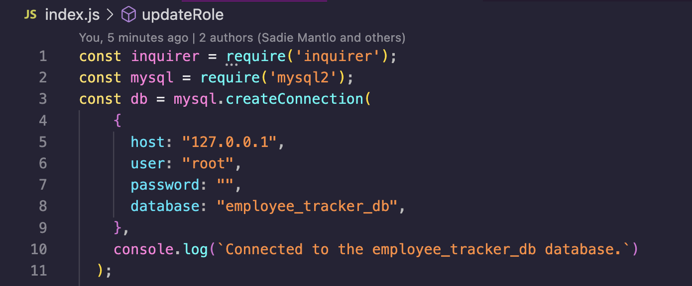
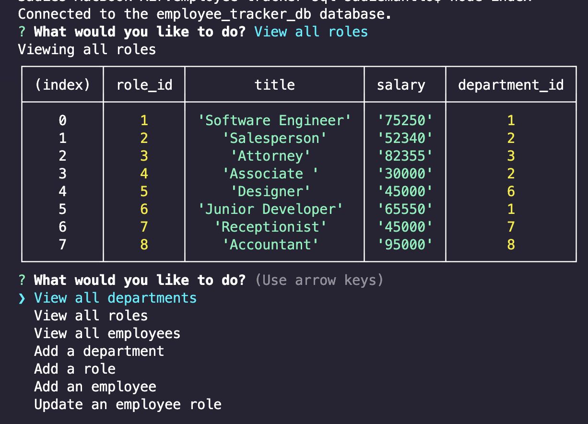

# **Employee Tracker**

## **Description**

This application can be used to view and manage the departments, roles, and employees in a company.
## **Installation**

MySQL2 and Inquirer

## **Usage**

To use this application you need to install MySQL2 and Inquirer. Once all the dependencies have been installed, run "node index.js" in the terminal and you will be prompted with a series of questions. From there, you will be able to view all departments, roles and employees, add departments, roles and employees, and update an employee's role.

### Make sure to change the MySQL connection information to your own

>### To watch a demo video click [here](https://drive.google.com/file/d/16o1-B10ovnKe-OE4y5yWnroXEPSttqBI/view)
